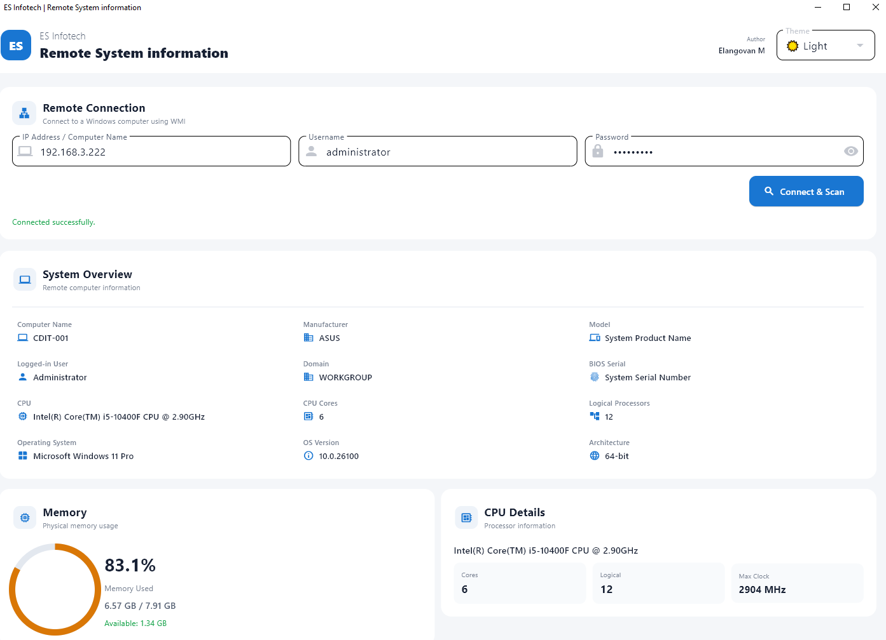

# remote-sysinfo-tool
Remote System Information Tool
* [❤️ Sponsor Me on GitHub](https://github.com/sponsors/Elangovan84)

A lightweight Python desktop application designed to remotely fetch detailed hardware and software system information from any Windows machine across a local or domain network using an IP address and administrator credentials.



## 🚀 Features
* **Remote Network Scan:** Fetch system information remotely using only a target IPv4 address.
* **Domain & Local Network Support:** Authenticate securely using network administrator credentials.
* **Comprehensive Hardware Diagnostics:** Gathers System Name, Manufacturer, Model, Serial Number, and CPU details.
* **Storage & Memory Breakdown:** Displays granular hard drive capacities (Total/Free Space) and RAM module allocations.
* **OS & Security Audit:** Reports the exact Windows OS version, domain name, active local user accounts, and the last logged-on user.

## 🛠️ Prerequisites
To successfully scan a remote machine on your network, ensure the following settings are configured:
1. **Administrator Account:** You must provide valid Local Administrator or Domain Administrator credentials for the target machine.
2. **Network Protocol Access:** The target machine must have WMI (Windows Management Instrumentation) or RPC network traffic allowed through its local Windows Firewall.
3. **Execution Privileges:** Run this tool on your local machine with elevated administrator privileges ("Run as Administrator").

## 📦 How to Download & Run

### Method 1: Pre-compiled Executable (Recommended)
1. Navigate to the **[Releases](../../releases)** section on the right side of this GitHub page.
2. Download the latest version packaged as a `.zip` file.
3. Extract the contents to a local folder.
4. Right-click `SystemInformation.exe` and select **Run as Administrator**.

### Method 2: Run from Source Code
If you prefer running it directly through Python:
```bash
# Clone the repository
git clone https://github.com
cd YOUR_REPO_NAME

# Install required dependencies (if using external libraries like wmi or impacket)
pip install -r requirements.txt

# Run the application
python main.py
```

## 🛡️ Antivirus False Positives Notice
Because this executable interacts directly with administrative network protocols to query remote machines, some aggressive antivirus software or Windows SmartScreen may flag the pre-compiled `.exe` file as malware. 

This tool is entirely open-source. If you are hesitant to run the pre-compiled binary, you are highly encouraged to inspect the source code files in this repository and compile the executable yourself using `pyinstaller`.

